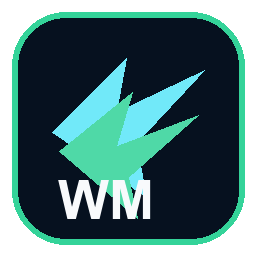

<p align="center">
  
</p>

<h1 align="center">WingMan</h1>

<p align="center">
  A real-time desktop interview assistant that captures system audio, transcribes it with Groq Whisper, detects interview questions, and streams AI-generated answers to a protected floating overlay.
</p>

<p align="center">
  <a href="https://github.com/sarthakdev143-lite/interview-hacker/releases"></a>
  <a href="LICENSE"></a>
  
</p>

---

## ✨ Features

- **Real-time audio capture** — WASAPI loopback on Windows captures system audio without microphone access
- **Groq Whisper transcription** — Live speech-to-text powered by `whisper-large-v3-turbo` with cross-chunk context for high accuracy
- **Smart question detection** — Heuristic + LLM classifier pipeline identifies interview questions from general conversation
- **Streamed AI answers** — Token-by-token answer generation using `llama-3.3-70b-versatile` (or alternative Groq models)
- **Protected overlay** — Floating, draggable, resizable overlay with `setContentProtection(true)` — invisible to screen-share and capture tools
- **Resume grounding** — Upload a PDF resume for answer personalization via PyMuPDF extraction
- **Secure key storage** — API keys encrypted via Electron `safeStorage` (OS keychain)
- **Session history** — Optionally persist question-answer exchanges as JSON for post-interview review
- **Global shortcuts** — Toggle, minimize, and focus the overlay without leaving the interview window

## 🔑 Prerequisites

- A **[Groq API key](https://console.groq.com/keys)** (free tier works)
- **Windows 10/11** (WASAPI loopback is used for audio capture)

## 📥 Installation

1. Download the latest `WingMan-X.X.X-setup.exe` from the [Releases](https://github.com/sarthakdev143-lite/interview-hacker/releases) page
2. Run the installer — you can choose the install location
3. Launch **WingMan** from the Start menu or desktop shortcut

> **Note:** Windows Defender or your antivirus may flag the bundled Python server. This is a false positive caused by PyInstaller packaging. Add an exclusion for the WingMan install directory if prompted.

## 🚀 Quick Start

1. **Paste your Groq API key** in the dashboard and click **Save key**
2. **Upload your resume** (PDF) or paste resume text directly
3. **Add extra context** — job description, role expectations, panel details
4. **Choose your model** and overlay preferences
5. Click **Start session** — WingMan begins listening to system audio
6. The floating overlay shows live transcript and streams answers when interview questions are detected

## ⌨️ Global Shortcuts

| Action | Shortcut |
|---|---|
| Toggle overlay visibility | `Ctrl+Shift+H` or `Ctrl+Alt+H` |
| Minimize overlay | `Ctrl+Shift+M` or `Ctrl+Alt+M` |
| Focus manual input | `Ctrl+Shift+Space` |

## 🏗️ Architecture

```
┌──────────────────────────────────────────────────┐
│  Electron Main Process                           │
│  ├─ Window Manager (dashboard + overlay)         │
│  ├─ Secure Store (safeStorage API keys)          │
│  ├─ Python Server Manager (sidecar lifecycle)    │
│  └─ IPC Handlers (trusted sender validation)     │
├──────────────────────────────────────────────────┤
│  React Renderer (Vite + Tailwind CSS)            │
│  ├─ Dashboard: setup, history, settings          │
│  └─ Overlay: transcript, answers, manual input   │
├──────────────────────────────────────────────────┤
│  Python Sidecar (Flask + SSE)                    │
│  ├─ WASAPI Loopback Audio Capture                │
│  ├─ Groq Whisper Transcription                   │
│  ├─ Question Detection (heuristic + LLM)         │
│  └─ Answer Streaming (Groq LLM)                  │
└──────────────────────────────────────────────────┘
```

## 🛠️ Development

```bash
# Clone the repository
git clone https://github.com/sarthakdev143-lite/interview-hacker.git
cd interview-hacker

# Install Node dependencies
npm install

# Create a Python virtual environment and install dependencies
python -m venv .venv
.venv\Scripts\activate
pip install -r python/requirements.txt

# Start development mode
npm run dev
```

`npm run dev` starts the Vite renderer, watches Electron main/preload builds, launches Electron, and starts the local Python server automatically.

### Environment Variables

Copy `.env.example` to `.env` and fill in:

| Variable | Description |
|---|---|
| `GROQ_API_KEY` | Optional fallback Groq API key (can also be set in the UI) |
| `WINGMAN_PYTHON_BIN` | Optional path to a custom Python binary |

## 📦 Building from Source

```bash
# Install PyInstaller dependencies
pip install -r python/requirements-pyinstaller.txt

# Build and package everything
npm run package
```

The installer will be created in the `release/` directory.

## 📄 License

[MIT](LICENSE) — Sarthak Parulekar
