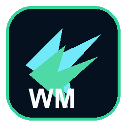

<p align="center">
  
</p>

<h1 align="center">WingMan</h1>

<p align="center">
  A real-time desktop interview assistant that captures system audio, transcribes it, detects interview questions, and streams AI-generated answers to a protected floating overlay — on a single free API key.
</p>

<p align="center">
  <a href="https://github.com/sarthakdev143-lite/interview-hacker/releases"></a>
  <a href="LICENSE"></a>
  
  
  
</p>

---

> ### ⚠️ Read this before you use it
>
> WingMan captures **all system audio**, which in a meeting means everyone in
> it. Recording or transcribing a conversation without the consent of every
> participant is illegal in many jurisdictions, and using an AI assistant in a
> live interview breaches the terms of most interview and meeting platforms —
> and, usually, the trust of the person on the other end.
>
> It is published as a study of a hard real-time problem: sub-second system
> audio → VAD → transcription → question detection → streamed LLM answer, on a
> free API tier. Use it to prepare for interviews, to rehearse against your own
> recordings, as a live captioning and note-taking aid, or as a reference for
> building low-latency audio pipelines.
>
> **You are solely responsible for how you use it.** Know the law where you
> live, get consent, and read [SECURITY.md](SECURITY.md) for what the app does
> with your audio and where your data goes.

## ✨ Features

- **Runs on one free key** — transcription (`whisper-large-v3-turbo`) and answers both use Groq. The free tier normally covers an entire interview at no cost
- **Real-time audio capture** — WASAPI loopback on Windows via `pyaudiowpatch` captures system audio without microphone access (macOS/Linux via `sounddevice` monitor / BlackHole)
- **Pay for speech, not silence** — dependency-free local VAD (`python/vad.py`) segments the stream and uploads only speech, so pauses cost nothing. Minimum is measured in voiced frames so keyboard clicks never reach a paid endpoint
- **Two transcription engines** — `groq` (default, batch, speech-only, free) or `deepgram` (opt-in streaming `nova-2` with interim results, ~9x cost, billed on connection time)
- **Smart question detection** — heuristic prefix/keyword pipeline + cheap Groq classifier. Direct questions (`tell me...`, `how...?`) bypass the LLM; ambiguous utterances are classified on a background thread
- **Multilingual interviews** — non-English sessions automatically route utterances with no English signal to the classifier (bounded by `MIN/MAX_CLASSIFIER_WORDS`) so imperative prompts like `cuéntame sobre...` are not dropped
- **Streamed AI answers** — token-by-token Groq chat completions with `openai/gpt-oss-120b` (and live fallback). Answers are grounded in resume + extra context and streamed to the overlay and to `POST /answer/manual`
- **Runtime model resolution** — `LLMClient.resolve_models()` lists what the key can actually reach at session start and falls back through `ANSWER_MODEL_PREFERENCES` when a saved ID was retired. Dashboard picker is populated from `POST /models`
- **Resilient rate-limit handling** — `LLMClient._create()` retries 429/408/5xx with `Retry-After` + capped backoff (`MAX_RETRY_WAIT_SECONDS = 10s`), then falls back to a sibling model. Streamed chunks are never retried once tokens have been shown
- **~800 ms end-to-first-token** — VAD hangover + Whisper round-trip + classifier + `gpt-oss-120b` TTFT (measured at wall-clock speed on recorded speech)
- **Protected overlay** — floating, draggable, resizable, transparent overlay with `setContentProtection(true)` (`WDA_EXCLUDEFROMCAPTURE` on Windows) — invisible to Teams / Zoom / Meet / OBS screen-share. Re-applied on `show`/`restore`/`focus`/`maximize`/`did-finish-load`
- **Resume grounding** — upload a PDF (PyMuPDF extraction) or paste resume text + job description / panel context
- **Live cost meter** — `python/usage.py` tracks speech seconds (exact VAD) and LLM tokens (real `chunk.x_groq.usage` counts). Shown in dashboard and via `GET /usage` / `usage` SSE events
- **Secure key storage** — both keys encrypted via Electron `safeStorage` (OS keychain) into `settings.json` under `userData`. Only `apiKeyStored` booleans reach the renderer
- **Session history** — optionally persist Q&A exchanges as JSON under `userData/history/` for post-interview review (`GET /history`, `history:open-folder`)
- **Global shortcuts** — toggle, minimize, and focus the overlay without leaving the interview window

## 🏗️ Architecture

Three runtimes, two transports.

```
┌──────────────────────────────────────────────────┐
│  Electron Main Process  (src/main.ts)             │
│  ├─ Window Manager (dashboard + overlay)         │
│  ├─ Secure Store (safeStorage API keys)          │
│  ├─ Python Server Manager (sidecar lifecycle)    │
│  └─ IPC Handlers (assertTrustedSender)           │
├──────────────────────────────────────────────────┤
│  React Renderer  (Vite + Tailwind, src/App.tsx)   │
│  ├─ Dashboard: setup, history, settings          │
│  └─ Overlay: transcript, answers, manual input   │
│  One bundle loaded twice (#/dashboard / #/overlay)│
├──────────────────────────────────────────────────┤
│  Python Sidecar  (Flask + SSE, python/server.py) │
│  ├─ WASAPI Loopback Audio Capture                │
│  ├─ Voice Activity Detection (silence is free)   │
│  ├─ Transcription (Groq Whisper │ Deepgram)      │
│  ├─ Question Detection (heuristic + LLM)         │
│  ├─ Answer Streaming (Groq chat completions)     │
│  └─ Usage / cost metering                        │
└──────────────────────────────────────────────────┘
```

### Dual transport

| Plane | Path | Auth |
|---|---|---|
| **Control** | `renderer → window.wingman.* → ipcMain.handle → PythonServerManager.request()` — session start/stop, settings, keys, overlay geometry, `POST /models` | Electron IPC + `SecureStore` (keys never cross to renderer) |
| **Data** | `renderer → http://127.0.0.1:<port>` directly — SSE `/transcript/stream` & `/answer/stream`, `POST /answer/manual`, `/resume/upload`, `/history` | `X-Wingman-Token` header (fetch) or `?token=` query (EventSource); `require_server_token` accepts both |

Main hands the renderer `serverPort` + `serverToken` inside `AppState`; the sidecar binds an ephemeral port on `127.0.0.1` and prints `PORT:<n>` on stdout.

### Audio → answer pipeline

```
WASAPI loopback (16 kHz mono int16) → SessionManager.audio_queue
  → Transcriber (GroqTranscriber | DeepgramTranscriber)
    → _on_transcript → _publish_transcript
      → accumulates segments; on QUESTION_SETTLE_SECONDS gap flushes:
         DIRECT_QUESTION_PREFIXES → enqueue immediately
         ambiguous → classifier thread (cheap model)
         non-question → drop
      → answer_queue → _stream_answer_worker
        → fans tokens to every SSE subscriber + private queue for /answer/manual
```

- **GroqTranscriber** (`python/vad.py` + `python/transcriber.py`): VAD-gated batch uploads. Two concurrent requests with `_emit_in_order` re-serialization; `on_activity` fires at speech onset so the overlay shows `transcribing` without waiting for Whisper. No interims.
- **DeepgramTranscriber**: streaming WebSocket with interim results.
- **Concurrency invariant**: every worker captures `runtime_id` / `stop_event` / `llm` at start and re-checks `self.runtime_id != runtime_id` before emitting. `start_session()` bumps `runtime_id` so a stopped session never leaks tokens into the next one.

### Sidecar handshake

`PythonServerManager` (`src/pythonServer.ts`) generates a 32-byte hex token, passes `WINGMAN_SERVER_TOKEN` + `WINGMAN_HISTORY_DIR`, then waits for `PORT:<n>` before polling `/health`. Spawn order: `WINGMAN_PYTHON_BIN` → packaged `resourcesPath/python/wingman-server/wingman-server.exe` → `.venv/Scripts/python.exe` (win) / `python3`. Packaged exe is `console=False`, so a Windows `netstat -ano` PID→port fallback is used. Unexpected exit triggers `scheduleServerRestart()` with a 1.2 s retry loop.

## 💸 What a session costs

The default engine uploads only detected speech, so a long interview with ordinary pauses is billed for a fraction of its wall-clock length.

| Engine | Billed on | 1 hr interview (~25 min speech) |
|---|---|---|
| Groq Whisper `whisper-large-v3-turbo` (default) | speech only (`record_audio` exact VAD) | ~$0.017, or **$0 on the free tier** |
| Deepgram `nova-2` streaming | connection time (`set_stream_seconds` wall clock) | ~$0.35 |

Answers add roughly $0.001–0.01 per interview depending on model. The dashboard `CostMeter` shows the running total; `GET /usage` on the local backend returns the same `UsageSnapshot` (`python/usage.py`).

## 🧰 Tech Stack

| Layer | Tech |
|---|---|
| Desktop | Electron 41, Vite 5, React 18, React Router 6, Tailwind CSS 3 |
| Backend | Python 3.10+, Flask 3, Groq SDK, PyMuPDF, sounddevice / pyaudiowpatch, websocket-client, numpy |
| Packaging | electron-builder (NSIS), PyInstaller (`python/wingman-server.spec`) |

## 💻 Platform support

| Platform | Download | Audio capture | Overlay hidden from capture |
|---|---|---|---|
| **Windows 10/11** | `.exe` installer | WASAPI loopback via `pyaudiowpatch` — no extra setup | Yes — `WDA_EXCLUDEFROMCAPTURE` |
| **macOS 11+** | `.dmg` (arm64 and x64) | Needs a virtual device — [BlackHole](https://github.com/ExistentialAudio/BlackHole) plus a Multi-Output Device | Yes — `setContentProtection` |
| **Linux** | `.AppImage` / `.deb` (x64) | PulseAudio/PipeWire `.monitor` source via `sounddevice` | X11 only, best-effort; **not under Wayland** |

All three are built and published by CI. **Windows is the only one routinely
tested in a real interview** — macOS and Linux builds are produced from the
same source and pass the same gate, but they get far less use, so treat them as
beta and please report what breaks.

Every build is **unsigned**. See [Installation](#-installation-end-users) for
the SmartScreen and Gatekeeper prompts that follow from that.

On Windows, health reports `capture_warning` on builds older than `10.0.22621`
(`python/server.py:health`).

## 🔑 Prerequisites

- **Node.js 18+** and **Python 3.10+**
- A **[Groq API key](https://console.groq.com/keys)** — free tier, **no credit
  card required**, and this is the only key you need. Sign in with Google or
  GitHub at [console.groq.com/keys](https://console.groq.com/keys), click
  *Create API Key*, and copy the `gsk_…` value. It is shown once
- A **[Deepgram key](https://console.deepgram.com/)** — optional, only if you
  switch the transcription engine to Deepgram in the dashboard (~9x the cost)

## 📥 Installation (end users)

Grab the file for your platform from the
[Releases](https://github.com/sarthakdev143-lite/interview-hacker/releases)
page.

**Windows** — run `WingMan-<version>-setup.exe`. SmartScreen will show
*"Windows protected your PC"*; click **More info → Run anyway**.

**macOS** — open `WingMan-<version>-arm64.dmg` (Apple silicon) or `-x64.dmg`
(Intel) and drag the app to Applications. Gatekeeper will refuse it on first
launch, so **right-click the app and choose Open**, or run:

```bash
xattr -dr com.apple.quarantine /Applications/WingMan.app
```

Then install [BlackHole](https://github.com/ExistentialAudio/BlackHole) and
create a Multi-Output Device, or there is no system audio to capture.

**Linux** — `chmod +x WingMan-<version>-x64.AppImage && ./WingMan-<version>-x64.AppImage`,
or `sudo dpkg -i WingMan-<version>-x64.deb`. You need a PulseAudio/PipeWire
monitor source enabled.

> Every build is **unsigned** — there is no Authenticode certificate or Apple
> Developer ID behind this project. Verify the `SHA256SUMS-*.txt` attached to
> the release, or [build from source](#️-development), if you would rather not
> take that on trust.

> **Windows Defender / antivirus** may flag the bundled `wingman-server.exe`. This is a false positive from PyInstaller packaging. Add an exclusion for the WingMan install directory if prompted. Test packaged behaviour with `release/win-unpacked/WingMan.exe`, not just `npm run dev`.

## 🚀 Quick Start

1. **Paste your Groq API key** in the dashboard and click **Save key** — that is the only key required for the default engine
2. **Upload your resume** (PDF, parsed locally via PyMuPDF) or paste resume text directly
3. **Add extra context** — job description, role expectations, panel details
4. **Choose transcription provider** (`groq` recommended), **model** (picker is populated live from `POST /models`), language, overlay preset/opacity, and history toggle
5. Click **Start session** — WingMan begins listening to system audio
6. The floating overlay shows live transcript and streams answers when interview questions are detected. Use **Ask for a follow-up answer…** for manual prompts (`Ctrl+Shift+Space` to focus)

### Global Shortcuts

| Action | Shortcut |
|---|---|
| Toggle overlay visibility | `Ctrl+Shift+H` or `Ctrl+Alt+H` |
| Minimize overlay | `Ctrl+Shift+M` or `Ctrl+Alt+M` |
| Focus manual input | `Ctrl+Shift+Space` |

## 🛠️ Development

```bash
# Clone
git clone https://github.com/sarthakdev143-lite/interview-hacker.git
cd interview-hacker

# Node deps
npm install

# Python env — the app spawns this venv directly
# (.venv/Scripts/python.exe on Windows, .venv/bin/python elsewhere),
# so install the deps into it rather than globally.
python -m venv .venv
.venv\Scripts\activate          # Windows
# source .venv/bin/activate     # macOS / Linux
pip install -r python/requirements.txt   # root requirements.txt re-exports this

# Dev mode (Vite renderer + main/preload watch + Electron + Python sidecar)
npm run dev
```

`npm run dev` is orchestrated by `scripts/select-dev-port.mjs` (picks a free port → `.dev-server.json`) and `scripts/launch-electron.mjs` (`VITE_DEV_SERVER_URL`). Nodemon watches `dist/main` + `dist/preload` and restarts Electron after the vite watch build lands.

### Available scripts

| Command | What it does |
|---|---|
| `npm run dev` | `predev` + concurrently: `dev:renderer` + `dev:main` + `dev:preload` + `dev:electron` |
| `npm run typecheck` | `tsc --noEmit` |
| `npm run lint` | `eslint --ext .ts,.tsx .` |
| `npm test` | `vitest run` — unit tests for `src/validation.ts` and `src/csp.ts` |
| `npm run test:python` | `node scripts/run-python-tests.mjs` (runs the suite with the project venv, not whatever `python` is on `PATH`) |
| `npm run verify` | `typecheck` + `lint` + `test` + `test:python` (full gate) |
| `npm run build` | Vite builds `renderer` + `main` + `preload` into `dist/` |
| `npm run package` | `verify` → `build` → PyInstaller sidecar (`scripts/build-python.mjs`) → `electron-builder` → `release/` |

Run a single Python test (use the venv interpreter so `numpy`/deps resolve):

```bash
.venv/Scripts/python.exe python/tests/test_vad.py
.venv/Scripts/python.exe python/tests/test_llm.py ResolveModelsTests.test_retired_model_falls_back_and_is_reported
```

There is no JS/TS test runner — `verify` is the gate.

### Environment variables

Copy `.env.example` to `.env`:

| Variable | Description |
|---|---|
| `GROQ_API_KEY` | Optional fallback Groq key (can also be set in the UI via `SecureStore`) |
| `DEEPGRAM_API_KEY` | Optional, only for `deepgram` transcription. Also settable in the UI |
| `WINGMAN_PYTHON_BIN` | **Dev only** — path to a custom Python interpreter. Packaged builds always use the bundled server unless it is genuinely missing |

> **Do not rely on `WINGMAN_PYTHON_BIN` in packaged builds.** Older versions took it unconditionally, and because `main.ts` loads `.env` via `dotenv/config` relative to cwd, launching a packaged build from the repo pointed it at the developer virtualenv.

### Local backend API (Python sidecar)

All routes except `OPTIONS` require `X-Wingman-Token` or `?token=` when `WINGMAN_SERVER_TOKEN` is set (`server.py:require_server_token`). Data-plane routes are called directly from the renderer at `http://127.0.0.1:<port>`.

| Method | Path | Notes |
|---|---|---|
| `POST` | `/session/start` | `{ resume_text, extra_context, language, model, api_key, deepgram_api_key, history_enabled, transcription_provider }` |
| `POST` | `/session/stop` | stops capture + transcriber, persists history if enabled |
| `POST` | `/resume/upload` | `multipart/form-data` PDF → `{ resume_text }` |
| `GET` | `/transcript/stream` | SSE `TranscriptEventPayload` + `usage`/`notice`/`status` |
| `GET` | `/answer/stream` | SSE `AnswerEventPayload` |
| `POST` | `/answer/manual` | `{ prompt }` → SSE answer stream (private queue) |
| `POST` | `/models` | `{ api_key }` → `{ models, recommended }` (live `Groq.models.list()`) |
| `GET` | `/history` | `{ sessions: SessionHistoryRecord[] }` |
| `GET` | `/usage` | `{ usage: UsageSnapshot }` |
| `GET` | `/health` | `{ status, port, platform, capture_warning, audio: {ready, message} }` |
| `POST` | `/shutdown` | used by `PythonServerManager.shutdown()` |

Types mirror `src/types/contracts.ts` (TS camelCase; Python snake_case — conversion in `main.ts:startSession`, except SSE/history types which stay snake_case).

## 📦 Building from Source

```bash
# PyInstaller deps (hiddenimports in python/wingman-server.spec)
pip install -r python/requirements-pyinstaller.txt

# Verify + build + package
npm run package
```

Artifacts land in `release/` (NSIS installer `WingMan-${version}-setup.exe` + `win-unpacked/`). If you add a new runtime-only Python dependency, add it to `hiddenimports` in `python/wingman-server.spec` or the packaged exe will fail at import.

## ✅ Verification & Tests

```bash
npm run typecheck
npm run lint
npm run test:python
# or
npm run verify
```

Python tests drive `SessionManager` through its private methods (`_publish_transcript`, `_flush_pending_question_if_ready`, `_yield_queue`, `_on_transcript`) and a `FakeTranscriber` mirroring `start`/`stop`/`feed`. Renaming those breaks the suite even when behaviour is unchanged.

## 📁 Project Structure

```
interview-hacker/
├─ src/
│  ├─ main.ts                 # AppState, PythonServerManager, IPC, shortcuts
│  ├─ windowManager.ts        # dashboard + overlay windows, hardenWindow()
│  ├─ secureStore.ts          # safeStorage-encrypted keys + settings
│  ├─ pythonServer.ts         # sidecar lifecycle, PORT:<n> handshake, token
│  ├─ preload.ts              # WingmanApi bridge
│  ├─ App.tsx / renderer.tsx  # hash-route branch /overlay vs /dashboard
│  ├─ types/contracts.ts      # WingmanApi, AppState, SessionStatus, UsageSnapshot
│  ├─ hooks/useSession.ts     # session draft, canStart, model catalog
│  ├─ hooks/useStream.ts      # SSE EventSource for transcript/answer streams
│  ├─ components/Overlay.tsx  # draggable/resizable overlay + manual input
│  └─ lib/backend.ts          # uploadResume, loadHistory, getServerBaseUrl
├─ python/
│  ├─ server.py               # Flask app (see table above)
│  ├─ session_manager.py      # AudioCapture → transcriber → question → answer
│  ├─ transcriber.py          # GroqTranscriber (VAD-gated batch) / DeepgramTranscriber
│  ├─ vad.py                  # UtteranceSegmenter (energy VAD, voiced-frame minimum)
│  ├─ llm.py                  # LLMClient (resolve_models, retries, reasoning_effort)
│  ├─ audio_capture.py        # WASAPI loopback / sounddevice capture + resample
│  ├─ usage.py                # UsageTracker (speech seconds + LLM tokens → USD)
│  ├─ resume_parser.py        # PyMuPDF extraction
│  └─ wingman-server.spec     # PyInstaller spec
├─ scripts/
│  ├─ select-dev-port.mjs     # picks free port → .dev-server.json
│  ├─ launch-electron.mjs     # launches Electron with VITE_DEV_SERVER_URL
│  └─ build-python.mjs        # runs PyInstaller
├─ build/                     # icon.png / icon.ico
├─ dist/                      # vite output (renderer / main / preload)
├─ release/                   # electron-builder output
└─ history/                   # persisted session JSON (userData/history in prod)
```

## ⚙️ Adding an IPC channel

Four edits, in order: `WingmanApi` in `src/types/contracts.ts` → bridge method in `src/preload.ts` → `ipcMain.handle` in `src/main.ts` **starting with `assertTrustedSender(event)`** → renderer call site. Numeric payloads via `requireFiniteNumber()`; enum settings via `normalizeSettingsUpdates()`. Keys never cross to the renderer — anything needing one reads from `SecureStore` in main (see `app:list-models`).

## 🔒 Security & Privacy

- Keys are encrypted with Electron `safeStorage` (OS keychain) in `userData/settings.json`; renderer only sees `apiKeyStored` booleans
- Local Flask server binds `127.0.0.1` ephemeral port and requires `WINGMAN_SERVER_TOKEN` per request
- Capture protection: `WindowManager.hardenWindow()` + `setContentProtection(true)` (and `WDA_EXCLUDEFROMCAPTURE` 0x11 on Windows). `WindowsGraphicsCapture` is disabled at startup. Verify with `GetWindowDisplayAffinity` (PowerShell `Add-Type` path) before reintroducing manual affinity logic
- Resume PDFs are parsed locally; nothing leaves the machine except Groq/Deepgram API calls

## 🩺 Troubleshooting

| Symptom | Fix |
|---|---|
| Sidecar prints `did not report a port in time` or exits instantly | Early exits are tracked locally (child nulls on exit). Check `userData/wingman.log` and that Defender/antivirus is not quarantining `wingman-server.exe`. Try `release/win-unpacked/WingMan.exe` outside the repo dir so `.env` does not inject `WINGMAN_PYTHON_BIN` |
| `WASAPI loopback device is unavailable` / `No monitor device found` | Windows: run `python -m pyaudiowpatch` to list devices, set correct default output. macOS: install BlackHole and create a Multi-Output Device. Linux: enable a PulseAudio/PipeWire monitor source |
| Answers/classifier always say "not a question" or return empty | Model likely retired or a reasoning model hit its token budget. Check `POST /models` / `Groq.models.list()` for live IDs; reasoning models (`gpt-oss`, `qwen3`) need `reasoning_effort: low` + larger `CLASSIFIER_MAX_TOKENS`/`ANSWER_MAX_TOKENS` |
| 429 rate-limit mid-interview | Expected on free tier — `_create()` retries per `Retry-After` (capped at 10 s) and falls back to a sibling model. UI shows `notice` events. Wait a few seconds or type a manual prompt |
| `WINGMAN_PYTHON_BIN` seems to break a packaged build | Remove it from `.env` when testing packaged builds; dev override only |
| No interim transcript with Groq | By design — Groq path is batch and only emits finals. Switch to `deepgram` provider for interim results |

## 🤝 Contributing

Issues and pull requests are welcome — see [CONTRIBUTING.md](CONTRIBUTING.md)
for the dev setup, the `npm run verify` gate every change has to pass, and the
conventions worth knowing before you touch the audio pipeline or IPC layer.

Found a security issue? Please report it privately — see
[SECURITY.md](SECURITY.md).

## 📄 License

[MIT](LICENSE) © 2026 Sarthak Parulekar.

Bundled fonts (Space Grotesk, IBM Plex Mono) are licensed separately under the
SIL Open Font License 1.1 — see [`src/assets/fonts/LICENSE`](src/assets/fonts/LICENSE).

---

<p align="center"><sub>Built with Electron + React + Flask. Model IDs are resolved at runtime — never assume a Groq model listed in this README still exists; check <code>POST /models</code> first.</sub></p>
